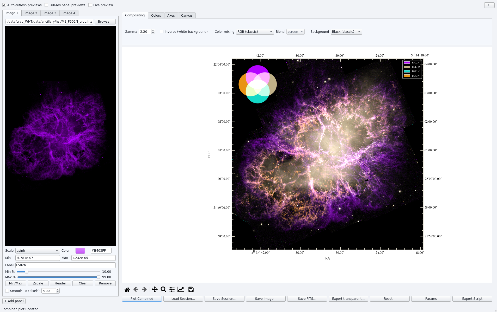
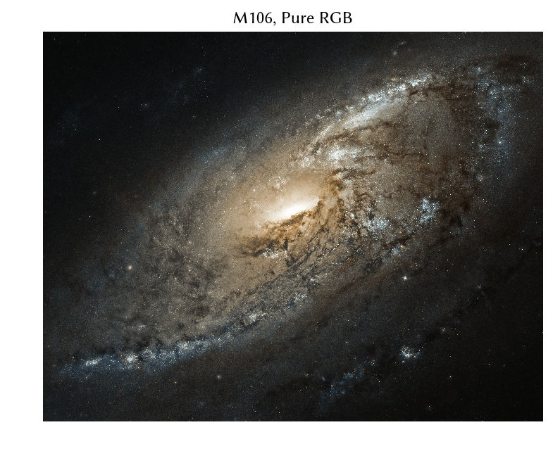
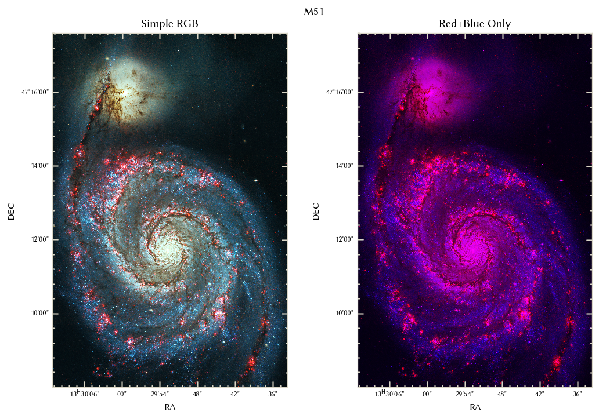
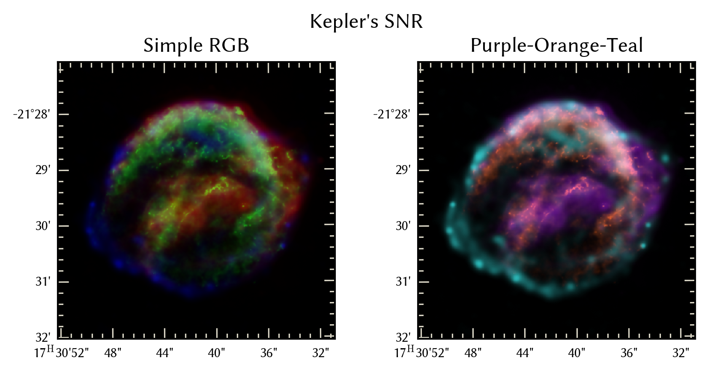
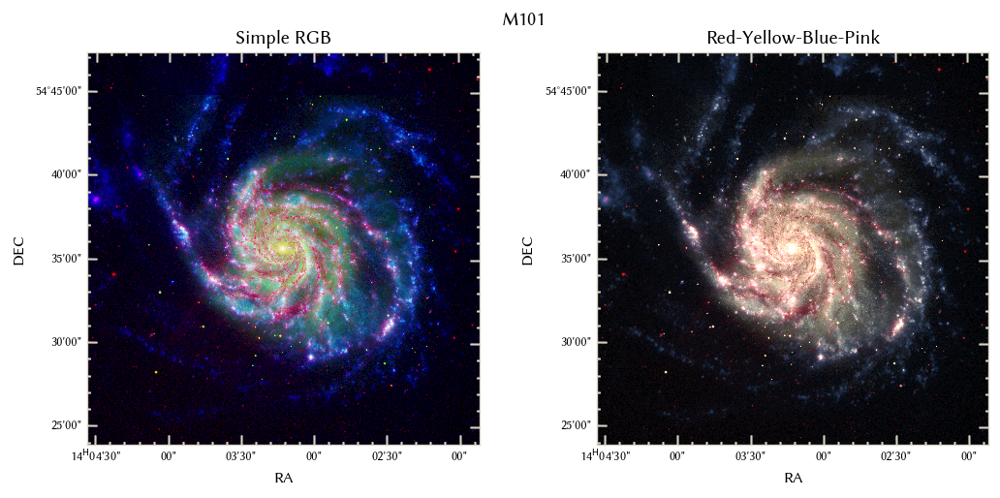
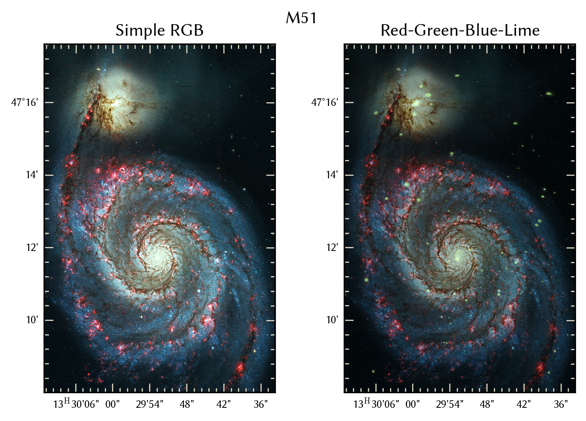
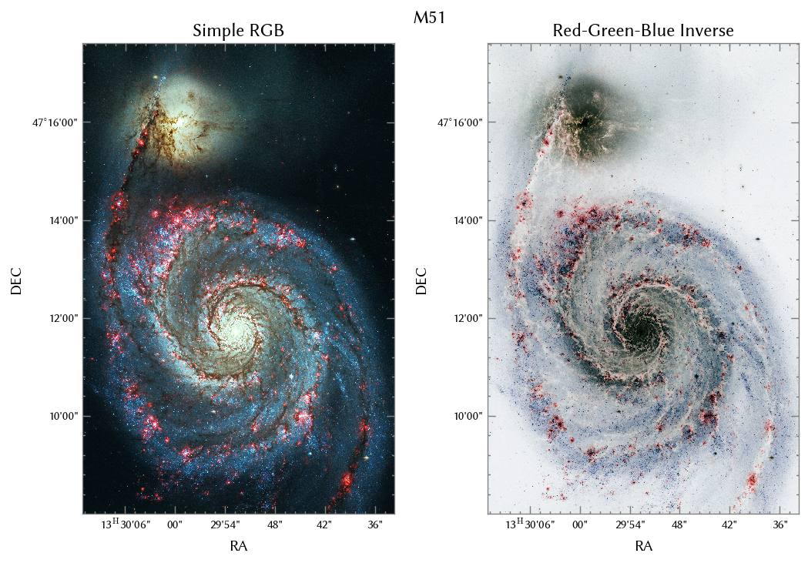

# multicolorfits

Colorize and combine multiple FITS images for visually aesthetic scientific
plots — with any number of image layers, in any colors.

**version 3.1.0**

API documentation: [https://multicolorfits.readthedocs.io](https://multicolorfits.readthedocs.io)

[](https://doi.org/10.5281/zenodo.3256060)
[](https://ascl.net/1909.002)
[](https://pypi.org/project/multicolorfits/)
[](https://pepy.tech/project/multicolorfits)
[](https://opensource.org/licenses/BSD-3-Clause)
[](https://www.python.org/downloads/)
[](https://www.astropy.org)
[](https://multicolorfits.readthedocs.io/en/latest/)
[](https://github.com/sponsors/pjcigan)

Sharing / customization: please play around — BSD 3-Clause License.

If you find this useful for your work, giving me (Phil Cigan) a nod in your
acknowledgements would be greatly appreciated.  For a formal citation, see
[`CITATION.cff`](CITATION.cff) (GitHub *Cite this repository*), BibTeX from
[the ASCL entry on ADS](https://ui.adsabs.harvard.edu/abs/2019ascl.soft09002C/abstract)
(`ascl:1909.002`), or the
[Zenodo DOI](https://doi.org/10.5281/zenodo.3256060) (*Export* panel; ADS also
indexes [10.5281/zenodo.3256061](https://ui.adsabs.harvard.edu/abs/2019zndo...3256061C/abstract)).

---

<picture>
  <source media="(prefers-color-scheme: dark)" srcset="./images/mcf_gui_Crab_dark.png">
  
</picture>

## What's new in v3

Version 3 rebuilds the project as a proper package **without** traits / traitsui
/ pyface / PyQt.  The core library uses only the scientific stack (numpy,
astropy, scipy, matplotlib, scikit-image).  GUIs and other capabilities are
optional extras — easiest path is `pip install "multicolorfits[all]"` (browser
GUI, desktop GUI, alignment, overlays, and signed-stretch helpers in one go).

- **Browser GUI** (primary): FastAPI + local webpage — `mcf.gui()` / `mcf-web`
  (preferred for interactive work: faster **Fast preview**, including the
  combined image)
- **Desktop GUI**: PySide6 — `mcf.gui_qt()` / `mcf-qt`

Scripting remains backward-compatible with v2 (`to_grey_rgb`,
`colorize_image`, `combine_multicolor`, …).  New capabilities include Lab / RYB
compositing modes, in-GUI layer alignment, palettes, overlays, session
save/restore, transparent cutouts, and more — see below and
[MIGRATION.md](MIGRATION.md).

## Dependencies

**Required:** numpy, matplotlib, astropy, scipy, scikit-image

Requires **Python 3.9+**.

**Recommended install** pulls every optional capability
(`web`, `qt`, `reproject`, `overlays`, `pysymlog`) so you do not have to pick
extras by hand.  Individual extras are listed below if you want a leaner
install.

| Extra | Provides |
|-------|----------|
| **`[all]`** | **Everything below (recommended default)** |
| `[web]` | Browser GUI (fastapi, uvicorn) |
| `[qt]` | Desktop GUI (PySide6) |
| `[reproject]` | FITS reprojection / alignment |
| `[overlays]` | Compass, beam, scale bar ([skyplothelper](https://skyplothelper.readthedocs.io)) |
| `[pysymlog]` | Symmetric-log stretch helper |

## Installation

Most users should install with all extras:

```console
pip install "multicolorfits[all]"
```

That gives you both GUIs, on-the-fly alignment, plot overlays, and related
helpers.  Then launch with:

```console
mcf-web
# or: mcf-qt
```

Core library only (scripting, no GUI):

```console
pip install multicolorfits
```

A la carte extras if you prefer a smaller install, e.g. browser GUI alone:

```console
pip install "multicolorfits[web]"
```

From a clone (development, with tests):

```console
pip install -e ".[all,test]"
```

**Conda + `[qt]`.**  The browser GUI (`[web]`) needs no Qt and is safe in
shared conda stacks.  `[qt]` / `[all]` pull **PySide6** from PyPI (a Qt6
runtime).  Mixing that — or leftover pip `PyQt6` — into a conda-forge **Qt5**
env can core-dump interactive `plt.show()` while headless Agg still works.
Prefer `[web]` in shared conda Qt5 environments; install the desktop GUI in a
dedicated env.  Audit / repair: see
[docs/installation.md](docs/installation.md#conda-environments-and-the-qt--pyside6-extra).

## For AI agents / LLMs

multicolorfits exposes a capability map that agents (and newcomers) can
ingest without guessing the API:

```python
import multicolorfits as mcf
mcf.overview()            # mental model, conventions, task index
mcf.recipes('cutout')     # copy-paste recipes matching a keyword
cat = mcf.overview(as_dict=True)   # structured catalog for tools
```

The same source (`multicolorfits/_overview.py`) generates the static files
[`llms.txt`](llms.txt) and [`llms-full.txt`](llms-full.txt) (inlined runnable
recipe code; the full file also adds function signatures).  Regenerate with
`python scripts/make_llms_txt.py` — CI fails if they drift.  On Read the Docs
they are also served at the site root
(`https://multicolorfits.readthedocs.io/en/latest/llms.txt`).

## Usage

### Interactive GUI

```python
import multicolorfits as mcf

mcf.gui()       # browser GUI — recommended default ([all] or [web])
# mcf.gui_qt()  # PySide6 desktop GUI ([all] or [qt])
# mcf.mcf_gui() # still works as an alias for gui()
```

Prefer **`mcf.gui()`** / `mcf-web` for interactive work: the browser app has a
much faster **Fast preview** path (including live updates of the combined
image) while you tweak stretches, colors, and compositing.  The Qt GUI shares
the same session model and is fine when you want a native window; new preview
performance work lands in the browser first.

Or from a terminal:

```console
mcf-web
# mcf-qt
```

Typical workflow:

1. Load and adjust each component image (stretch, levels, color, optional smoothing).
2. Choose compositing mode / background; use **Fast preview** while iterating,
   then **Plot Full Resolution** for the WCS figure.
3. Re-adjust and replot as needed.
4. Save an image, FITS RGB cube, session JSON, or an export script.
   Sessions round-trip with **Save Session…** / **Load Session…** (or
   `mcf.gui(state='session.json')`).

If layers are on different pixel grids, use **Align layers…** (needs
`[reproject]`), or reproject in a script first.

### Scripting

```python
import astropy.io.fits as pyfits
import multicolorfits as mcf

data1, hdr1 = pyfits.getdata('image1.fits', header=True)
data2, hdr2 = pyfits.getdata('image2.fits', header=True)   # same pixel grid

grey1 = mcf.to_grey_rgb(data1, rescalefn='asinh', min_max=[0., 1.2], gamma=2.2)
grey2 = mcf.to_grey_rgb(data2, rescalefn='sqrt',  min_max=[0., 0.8], gamma=2.2)

col1 = mcf.colorize_image(grey1, '#C11B17', colorintype='hex', gammacorr_color=2.2)
col2 = mcf.colorize_image(grey2, '#4CC417', colorintype='hex', gammacorr_color=2.2)

combined = mcf.combine_multicolor([col1, col2], gamma=2.2)

mcf.plot_combined_rgb(combined, hdr1, 'My 2-color image', './out.png')
mcf.save_rgb_fits('./out_rgb.fits', combined, hdr1)
```

`PanelState.load_fits()` / `squeeze_image()` drop degenerate FITS axes and strip
ghost higher-axis WCS cards from nominally 2D headers.

If images are not on a common grid (included with `[all]`, or install
`[reproject]`):

```python
data2_reproj = mcf.reproject_image(data2, hdr2, hdr1)
```

### Mid-level session API

Both GUIs drive the same `McfSession` object, which you can also use in scripts:

```python
from multicolorfits import McfSession

s = McfSession()
s.panels[0].load_fits('image1.fits')
s.panels[0].stretch = 'asinh'
s.panels[0].apply_zscale()
s.panels[0].color = '#C11B17'
s.compose.gamma = 2.2

combined = s.render_combined()
s.save_rgb_fits('./out_rgb.fits')
print(s.export_script())
```

## Tutorials / examples

- Sphinx examples (canonical): [docs/examples/](docs/examples/)
  (NGC 602, WLM, M74 cutouts, Crab gallery, color-space suite)
- Short GitHub pointers: [examples/](examples/)
- Conceptual guides: [docs/guide/](docs/guide/)
- Tutorials (notebooks): [docs/tutorials/](docs/tutorials/)

Also see the gallery images further below.

## Features

* Image panels in the GUI (default four; add more with **+ Add panel**, up to 16)
  - Load by path, file browser, or upload (web GUI)
  - **Note:** layers must share a pixel grid to combine.  Use **Align layers…**
    in the GUI or `reproject_image` / `align_stack` in scripts (`[reproject]`).
  - Scripts can still construct `McfSession(n_panels=N)` or call
    `session.add_panel()` / `remove_panel()` directly
* Per-layer color (hex / picker), stretch (linear, sqrt, squared, log, power,
  sinh, asinh, …), min/max or percentile levels, zscale, optional Gaussian smoothing
* Header editor per panel; save/load header text
* Compositing modes: classic RGB sum; **CIE Lab** (recommended alternative);
  experimental HSV/HSL; subtractive **RYB** / **CMYK**; background black / white /
  transparent / custom color
* Curated palettes and hue-wheel “tune colors”, with a color-vision safety check
* Combined figure options: WCS tick format, gamma, canvas color (incl. transparent),
  channel legend, color-combination swatch, band labels
* Optional WCS overlays (compass, beam, scale bar) via `[overlays]`
* **Fast preview** (downsampled float32, including the combined image) and
  **Plot Full Resolution** WCS plot — snappiest in the browser GUI
* Light / dark GUI theme
* **Save / load GUI sessions** as JSON (paths + settings, not pixels) —
  resume later or preload with `mcf.gui(state=…)` / `mcf-web --state`
* Save image (png/jpg/pdf/…), FITS RGB cube with provenance HISTORY, transparent
  cutouts for slides/stamps, and an export-script for recreating the plot
* Cursor readout of sky coordinates and per-layer values on the combined view
* Notebook embed (`mcf.gui_embed`) for Jupyter / Colab demos

## Color mixing (CIE Lab and friends)

Classic `combine_multicolor` sums RGB channels.  That is fast, but bright
overlaps can wash out toward white.  Lab mixing keeps hues more distinct:

```python
combined = mcf.combine_multicolor_colorspace(
    [col1, col2], colorspace='lab', blend='screen', gamma=2.2)
```

| `blend` | Behavior | Good for |
|---------|----------|----------|
| `'screen'` (default) | Accumulates brightness gracefully | General use |
| `'max'` | Brightest layer wins per pixel | Preserving each layer's hue |
| `'sum'` | Clipped sum | Matching the classic RGB look |
| `'mean'` | Average | Mixing plain colors |

`colorspace='lab'` is supported in the GUIs.  `'hsv'` / `'hsl'` remain
experimental.  See [docs/guide/color_compositing.md](docs/guide/color_compositing.md)
and [examples/colorspace_comparison.md](examples/colorspace_comparison.md).

**RYB** and a proper background control (white / transparent / custom) replace
the old “inverse” white-background trick without flipping hues.

## WCS overlays (optional)

```bash
# Already included with: pip install "multicolorfits[all]"
pip install "multicolorfits[overlays]"   # pulls in skyplothelper
```

```python
s.compose.show_compass = True
s.compose.show_beam = True          # needs BMAJ/BMIN in the FITS header
s.compose.show_scale_bar = True
```

`plot_combined_rgb(...)` accepts the same overlay flags; Export Script
emits them when enabled.  Advanced annotation (offset WCS, graticules, globes)
remains in the companion [skyplothelper](https://skyplothelper.readthedocs.io) package.

## Browser GUI (detail)

```bash
# Prefer: pip install "multicolorfits[all]"
pip install "multicolorfits[web]"
mcf-web                 # or: python -c "import multicolorfits as mcf; mcf.gui()"
mcf-web --browser firefox
mcf-web --no-browser    # start server only; open the printed URL yourself
```

```python
import multicolorfits as mcf
mcf.gui()                       # system default browser
mcf.gui(browser='firefox')      # or 'google-chrome', 'chromium', …
mcf.gui(open_browser=False)     # URL printed; open manually
```

A local server starts on `http://127.0.0.1:8321` (browser opens automatically
unless `--no-browser` / `open_browser=False`).  Everything runs on your
machine.  See [docs/tutorials/gui_web_walkthrough.md](docs/tutorials/gui_web_walkthrough.md)
for layout details and more browser-selection notes.

Highlights: sectioned controls (Compositing, Colors, Axes, Canvas), **Fast
preview**, palette picker, channel legend / swatch / band labels, optional
overlays, grid-mismatch detection with one-click align, Save Image / FITS /
session / export script, and transparent-cutout export.

### Notebooks (Jupyter / Colab)

```python
import multicolorfits as mcf

s = McfSession()
s.load_files(['a.fits', 'b.fits'], colors=['#f00', '#0ff'])
mcf.gui_embed(session=s, height=950)
```

See [docs/tutorials/gui_notebook_embed.py](docs/tutorials/gui_notebook_embed.py).

## Desktop GUI (PySide6)

```bash
# Prefer: pip install "multicolorfits[all]"
pip install "multicolorfits[qt]"
mcf-qt
```

Same core workflow in a native window with an embedded matplotlib WCS canvas.
Prefer the browser GUI (`mcf.gui()`) when you want the fastest live combined
preview; new interactive performance work lands there first.

Use a **dedicated** environment for `[qt]` if your main conda env already
ships Qt5 / PyQt5 — see the [conda note under Installation](#installation).

## Spotted in the wild

A partial list of papers and posts with multicolorfits figures:

* [Levy+2024, ApJ, 973, L55](https://ui.adsabs.harvard.edu/abs/2024ApJ...973L..55L/abstract) — Figure 1
* [Kreckel+2024, A&A, 689, A352](https://ui.adsabs.harvard.edu/abs/2024A%26A...689A.352K/abstract) — Figures 1 and 3
* [Watkins+2023, ApJ, 944, L24](https://ui.adsabs.harvard.edu/abs/2023ApJ...944L..24W/abstract) — several figures
* [Rigby+2021, MNRAS, 502, 4576](https://ui.adsabs.harvard.edu/abs/2021MNRAS.502.4576R/abstract) — Figure 1
* [Marian+2020, ApJ, 904, 79](https://ui.adsabs.harvard.edu/abs/2020ApJ...904...79M/abstract) — [Figures 2 & 8](https://iopscience.iop.org/article/10.3847/1538-4357/abbd3e#apjabbd3ef2)
* [Watkins+2019, A&A, 628, A21](https://ui.adsabs.harvard.edu/abs/2019A%26A...628A..21W/abstract) — [Figure 1](https://www.aanda.org/articles/aa/full_html/2019/08/aa35277-19/F1.html)
* Nature *Behind the Paper* (SN 1987A dust) — [splash](https://astronomycommunity.nature.com/posts/57171-peering-into-the-dusty-heart-of-sn-1987a) · [image set](https://images.zapnito.com/uploads/976eb83c22e0a42a3889d30569cd115b/c7ef3498-2ccf-4f69-ae64-20795f8869a9.jpeg)

---

## Motivation

* Stretch levels and colors were slow to iterate in plain plotting scripts.
* Photoshop / GIMP can make pretty images, but we often want a **programmatic**
  path that keeps WCS and FITS provenance.
* Colorizing beyond pure red / green / blue (and beyond three layers) is useful
  for multi-wavelength work and press-ready figures.

Useful places to download tidy FITS for experiments:

- [Chandra OpenFits](http://chandra.harvard.edu/photo/openFITS/multiwavelength_data.html)
- [Fits Liberator datasets](https://www.spacetelescope.org/projects/fits_liberator/datasets_archives/)
- [LITTLE THINGS (NRAO)](https://science.nrao.edu/science/surveys/littlethings)
- [SkyView](https://skyview.gsfc.nasa.gov/current/cgi/titlepage.pl)
- [SDSS SkyServer](http://skyserver.sdss.org/dr15/en/tools/explore/Summary.aspx?)
- [Tom Williams' data_buttons](https://github.com/thomaswilliamsastro/data_buttons)
- [obsplanning.download_cutout()](https://github.com/pjcigan/obsplanning)

The Kepler, M51, M101, and M106 examples below use Chandra OpenFits data.

Combining frames as pure red / green / blue is common — especially for filters
that roughly match R, G, and B light:

<picture>
  <source media="(prefers-color-scheme: dark)" srcset="./images/m106_pureRGB_dark.png">
  
</picture>

But what if you only have two images (e.g. red and blue, no green)?

<picture>
  <source media="(prefers-color-scheme: dark)" srcset="./images/m51_RBonly_dark.png">
  
</picture>

Other times you may want:

- Something eye-catching for a press release

<picture>
  <source media="(prefers-color-scheme: dark)" srcset="./images/kepler_POT_dark.png">
  
</picture>

- Multi-wavelength (optical + radio + X-ray) in a more natural-looking palette

<picture>
  <source media="(prefers-color-scheme: dark)" srcset="./images/m101_RYBP_dark.png">
  
</picture>

- More than three layers (e.g. X-ray sources on an RGB optical stack)

<picture>
  <source media="(prefers-color-scheme: dark)" srcset="./images/m51_RGBL_dark.png">
  
</picture>

- A white-background / inverted presentation style

<picture>
  <source media="(prefers-color-scheme: dark)" srcset="./images/m51_RGB_inverse_dark.png">
  
</picture>

In v3, prefer the compositing **Background** control (white / transparent /
custom) instead of the legacy inverse checkbox — bright colors stay true while
empty sky fades to the chosen background.

---

## Considerations / caveats

- For sequential filter bands (e.g. G/R/I, J/H/K), combos near standard R/G/B
  (such as red + yellow + blue) usually look most natural.
- Results are best when layer colors have similar luminance.
- Some color choices can confuse overlaps (e.g. red + blue already make purple).
- On-screen color is not the same as print CMYK; use the CMYK mix mode or a
  print workflow when preparing hardcopy.
- Layers must share a pixel grid before combining — align in the GUI or with
  `reproject_image` / `align_stack`.
- Large files: use **Fast preview** for interactive work; **Plot Full
  Resolution** when exporting.

## Tests

```bash
pip install -e ".[test]"
pytest
```

## Migrating from v2.x

See [MIGRATION.md](MIGRATION.md).  Short version: scripting code runs unchanged;
install with `pip install "multicolorfits[all]"` for GUIs and helpers, or pick
`[web]` / `[qt]` à la carte; traits / traitsui / pyface / PyQt are no longer
required.
