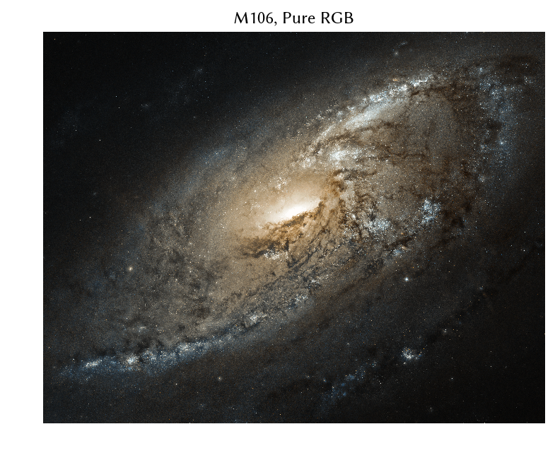
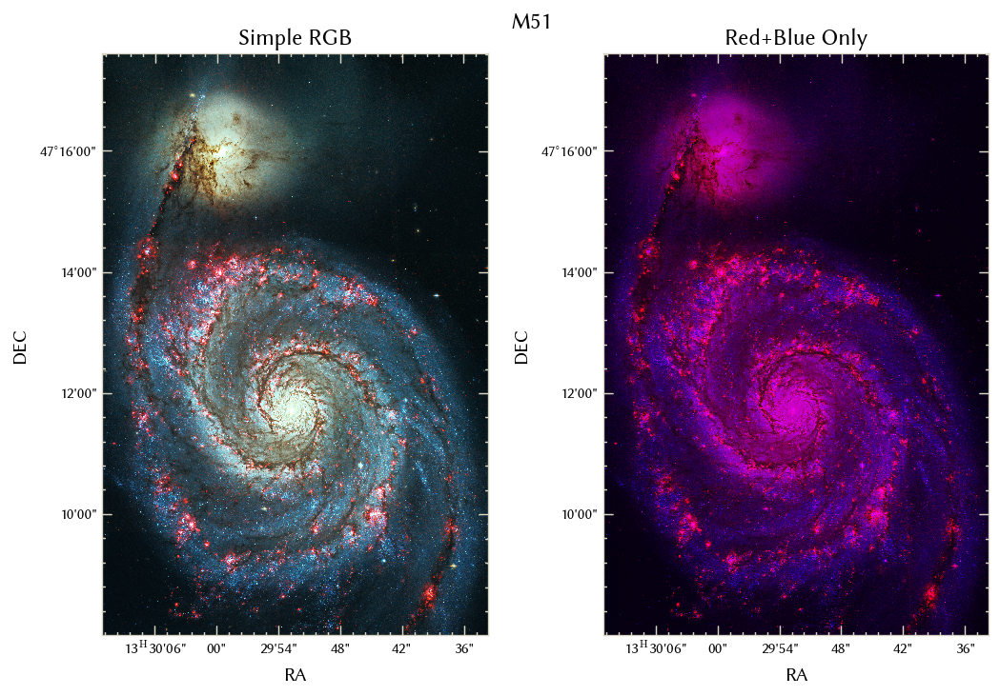
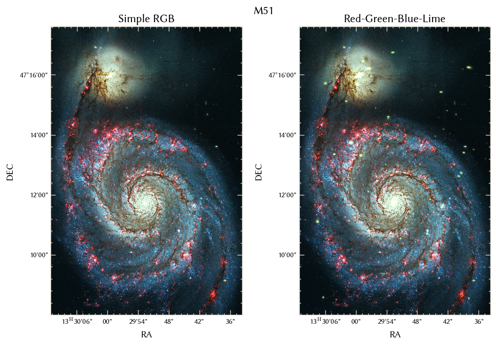

multicolorfits -- a GUI tool to colorize and combine multiple fits images for making visually aesthetic scientific plots

version 2.0.1

API documentation at [https://multicolorfits.readthedocs.io](https://multicolorfits.readthedocs.io)


[](https://doi.org/10.5281/zenodo.3256060)


Sharing/Customization: Please, play around!  (MIT License)

If you find this useful for your work, giving me (Phil Cigan) a nod in your acknowledgements would be greatly appreciated.  For the intrepid and kind people who are able to include an actual reference in their work, bibtex and other citation styles can be generated for [the ASCL entry on ADS](https://ui.adsabs.harvard.edu/abs/2019ascl.soft09002C/abstract), otherwise the [Zenodo DOI bibtex](https://doi.org/10.5281/zenodo.3256060) ('Export' panel on bottom right) is another option.  


-----------------------


# Dependencies

* numpy
* matplotlib 
* astropy
* scipy
* pyface
* PyQt5 (PyQt4 should still work) 
* traits, traitsui
* scikit-image (skimage)

* reproject and/or kapteyn, for the optional reprojection convenience functions (montagepy suppport may be added in the future)

- Tested in python 3.7 (and python 3.4 & 2.7 with PyQt4)


# Installation

Install with pip
```console
pip install multicolorfits
```

Alternatively, you can simply save a copy of multicolorfits.py in a local working directory.  This is suitable for running it in standalone mode (from the terminal), and does not require a regular installation with pip. 


# Usage

To call it interactively from within e.g., ipython:

```python
import multicolorfits as mcf

mcf.mcf_gui()  #This command runs the interactive viewer
```


Alternatively, can be used as a standalone script, from a terminal:

```console
python multicolorfits.py
```


When the viewer appears:
1. Load and adjust the component images
    * In the left panel, load up to four images.  A snapshot preview will be visible after clicking "Plot Single".
    * Adjust the stretch function and levels of each image.  
2. Combine the component images to plot a single combined image
    * In the right panel (at the top), adjust the tick color and WCS format 
    * At the bottom of the right panel, click "Plot combined" to display the final product
3. Re-adjust component images and re-plot as necessary
4. If desired, use buttons at the bottom right to print some of the plot params, save as image, or save as a fits RGB cube.


# Tutorials / Examples 

[Follow this link for some multicolorfits tutorials](./examples.md)

Also see some more example images below.


# Features

* Can load up to 4 images (you could easily customize it to include more)
    - Can copy/paste into input box or use file explorer
    - **__Note:__** At the moment, all input images must share a common pixel grid (no reprojection is done on the fly, though functions are included to do this manually in scripts)
* Specify your preferred color for each image:
    - Type in HEX/HTML color code (or fraction 0.0--1.0 for shades of grey)
    - Use a GUI color picker -- allows interactive color selection
* Interactively adjust each image's stretch and levels
    - Stretch functions include linear, square root, squared, log, power, sinh, asinh
    - Specify data min/max with input boxes, slidebar, or auto min/max & Zscale buttons
* View each input image separately in the left panel, and the combined image in the right panel
* Ability to adjust the gamma value (default=2.2)
* Specify WCS as sexagesimal or degree
* Can specify WCS tick color with input box or color picker (useful for changing to light ticks with dark background)
* Use of matplotlib interactive plot buttons (zoom/pan/home/ edit labels/ etc.)
* The main window (right panel) has a status bar that prints out the cursor's current position in world coordinates, and also prints out the R,G,B values at that pixel.
* Save image (.png, .jpg, .pdf...)
* Save fits file with RGB channels
* Print out plot/scale parameters used to the terminal, for use with custom plot commands
* Can make 'inverse' RGB plots (must click 'Plot Inverted Single' for each component before clicking 'Plot Inverted Combined')


# Spotted in the wild

Here are some plots out in the real world that were made with multicolorfits

* [Watkins+2019, A&A, 628A, 21](https://arxiv.org/abs/1906.09275) -- [Figure 1](https://www.aanda.org/articles/aa/full_html/2019/08/aa35277-19/F1.html)


-----------------------


# Motivation

I developed this tool for a variety of reasons.  
* I was sick of how long it took to manually get appropriate stretch levels, etc. for files for use in python plotting scripts
* It's possible to do this kind of thing with e.g., Photoshop or GIMP, but perhaps want a method for doing things __programmatically__
* I wanted a way to colorize images while retaining WCS info -- for plotting coordinates on the axes
* I wanted to expand beyond just the simple pure red + pure green + pure blue combination.  Sometimes these colors can make for odd results (to quote a collaborator: "That's weird, stars shouldn't look green...")
* I wanted to experiment with non-standard display options -- see, e.g., the 'inverted' RGB cubes (white background) work in progress


I made a short tutorial a couple years ago on the basics of colorizing and combining fits images, which should provide a decent starting point: [http://research.endlessfernweh.com/multi-color-images/](http://research.endlessfernweh.com/multi-color-images/)  


Here are some useful resources for downloading some nicely tidied-up fits files suitable for using in this tool:
- [Chandra OpenFits page](http://chandra.harvard.edu/photo/openFITS/multiwavelength_data.html)
- [Fits Liberator Datasets Page](https://www.spacetelescope.org/projects/fits_liberator/datasets_archives/)
- [LITTLE THINGS (dwarf galaxy survey) data hosted by NRAO](https://science.nrao.edu/science/surveys/littlethings)
- [SkyView (Virtual Observatory)](https://skyview.gsfc.nasa.gov/current/cgi/titlepage.pl)
- [Sloan Digital Sky Survey (SDSS) Sky Server](http://skyserver.sdss.org/dr15/en/tools/explore/Summary.aspx?)
- [Tom Williams' data_buttons, a very useful tool for grabbing data for your favorite target](https://github.com/thomaswilliamsastro/data_buttons)

I will be using the Kepler, M51, M101, M106 data found at the Chandra link above for the examples below.


Combining frames colorized to red, green, and blue is common practice - especially useful for images of the sky taken with filters that roughly correspond to R, G, and B light.  


HOWEVER - what if you have, say, only two images?  Maybe you only have the red and blue, but not the green.  



Other reasons you may not be satisfied with a simple pure RGB cube: 

- Maybe you want to make it 'pretty' or eye-catching for a press release


- Maybe your images don't correspond to what your eye normally thinks should be the R,G,B channels and you want to cast it in a more 'normal'-looking hue combo (e.g., combining optical+radio+X-ray)


- Maybe you want to highlight one of the images or give them a different color to match another plot that you saw in a paper.

- Maybe you want to include more than 3 images (e.g., some X-ray sources on top of your RGB?)




- Maybe you just want to explore display options, like this 'inverted' color combination.


----------------------------


# Considerations/Caveats/Limitations

- For sequential combinations of physical filters/bands (e.g., [G,R,I] images, [J,H,K], etc. ), color combos similar to standard R,G,B (such as red+yellow+blue) will usually give the most 'natural'-looking results.  
- Things tend to work best when your color choices have similar luminance (mixing light and dark colors can do weird things)
- Certain color combos can lead to confusion (for example: red+blue adds to purple, so maybe don't choose red+purple+blue for the hues of your component frames)
- The RGB color gamut is more limited than other colorspaces such as, e.g., CIE LAB, so you may not be able to get some specific colors you want
- I haven't completely finished developing the 'inverted' (white background) RGB feature, so it doesn't behave 100% as expected
- What you see on the screen will not likely appear the same way on printed paper -- need to convert RGB to CMYK for that.
- Currently all input files must have same projection/pixel grid -- do all your reprojection before loading them.  Astropy and the reproject package are your friends for that. See the WLM tutorial for example usage of the functions for this that are included with multicolorfits.
- This has not been optimized for speed.  In particular, it can be quite slow at interactive level adjustment for large files. (UN-checking the Auto-Refresh button at the top of the GUI will help.)  This could certainly be improved in future versions.


