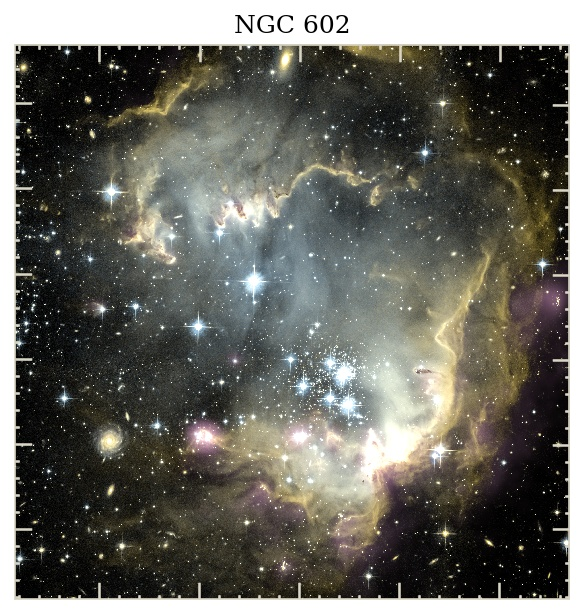
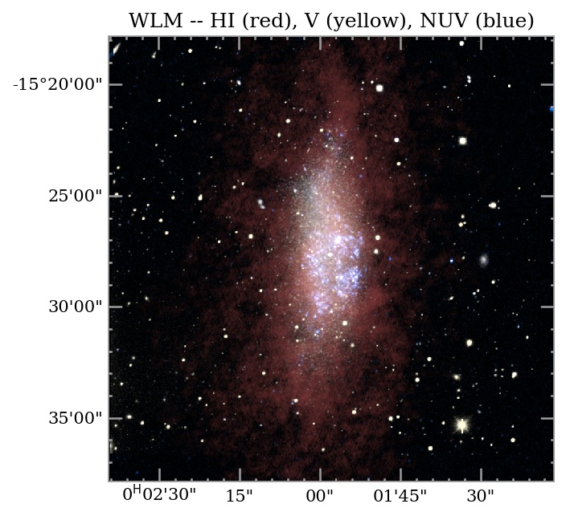

Here are some tutorials of how to create multicolor images in a script.  (Click on the name.)

- [NGC 602](./examples/ngc602.md)
This example demonstrates how to script the process of making a multi-color RGB image from fits files that are all projected onto the same pixel grid.   

<a href="./examples/ngc602.md">  

------------------

- [WLM](./examples/wlm.md)
This example demonstrates a workflow to crop one 'master' fits file to a desired size, reproject the other images to the same pixel grid, and then create a multi-color RGB image from them.

