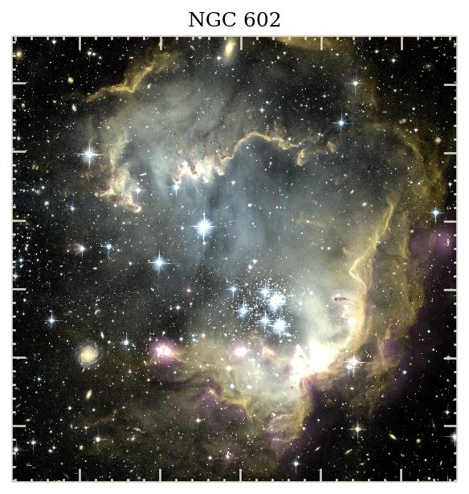
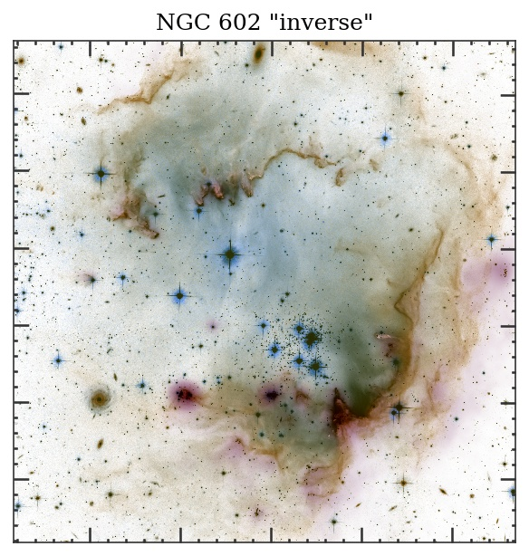
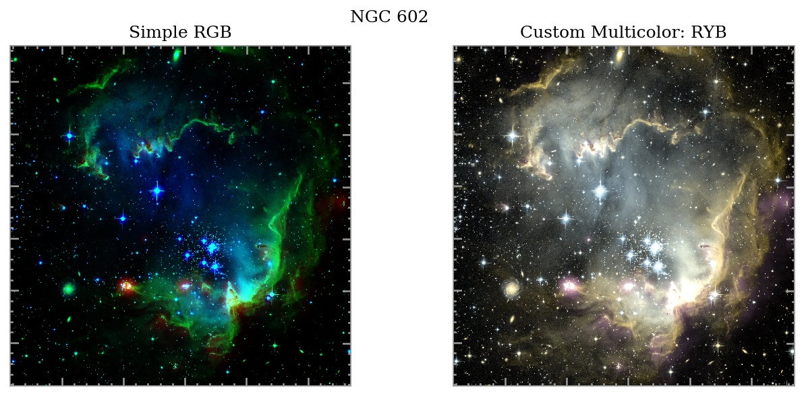
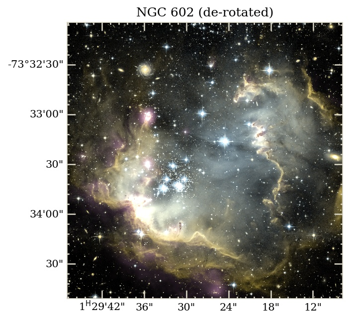

#  NGC 602  


  -------  NGC 602, a very pretty region in space  --------
 
 You can download the fits files from  [the Chandra OpenFits page](http://chandra.harvard.edu/photo/openFITS/multiwavelength_data.html)
 
 Here, I use the IR, R-band, and B-band images.

```python
import numpy as np
import astropy.io.fits as pyfits
import multicolorfits as mcf

### Load the data
n602_irdat,n602_irhdr=pyfits.getdata('./ngc602_ir.fits',header=True)
n602_Rdat,n602_Rhdr=pyfits.getdata('./ngc602_optical_R.fits',header=True)
n602_Bdat,n602_Bhdr=pyfits.getdata('./ngc602_optical_B.fits',header=True)
```

These are already all projected onto the same pixel grid.  No additional cropping or reprojection is needed to continue creating the multi-color RGB image in this tutorial.  
However, note that because the images are rotated ~90 degrees from N alignment, that will mess up the standard astropy WCS axis during plotting.  See more about this at the end.

-  Convert the single images (greyscale) to RGB format (still greyscale, but now with R,G,B channels)
You can use the option checkscale=True here to bring up a plot window to see your scaling (useful if you're not using the GUI to do this interactively).  For more serious automation you can just set it to False (default) to skip that step.

```python
n602_ir_greyRGB=mcf.greyRGBize_image(n602_irdat,rescalefn='linear'); 
n602_R_greyRGB=mcf.greyRGBize_image(n602_Rdat,rescalefn='linear'); 
n602_B_greyRGB=mcf.greyRGBize_image(n602_Bdat,rescalefn='linear'); 
```

- Now colorize each greyscale RGB image using colorize_image() 
The color can be either HTML/HEX, RGB tuples, or HSV tuples (default).  
Whatever you use, specify colorintype='hex', 'rgb', or 'hsv'  -- all three usages shown below
--> This will take some seconds for large files of several MB.

```python
n602_ir_purple=mcf.colorize_image(n602_ir_greyRGB, '#BE599E', colorintype='hex')
n602_R_orange=mcf.colorize_image(n602_R_greyRGB, (0.1169, 0.9054, 0.8706), colorintype='hsv') # '#DEA215' in hex
n602_B_blue=mcf.colorize_image(n602_B_greyRGB, (119,192,249), colorintype='rgb') # '#77C0F9' in hex
```

- Combine the separate colored images into one master RGB image with combine_multicolor( list of all RGB ims to combine )
```python
n602_POB=mcf.combine_multicolor( [n602_ir_purple, n602_R_orange, n602_B_blue], gamma=2.2, inverse=False)
```

- Save out the example plot -- mcf has plotsinglemulticolorRGB(combined_image,header,title,savepath) for a quick look
```python
mcf.plotsinglemulticolorRGB(n602_POB, n602_irhdr, 'NGC 602', './n602_POB.jpg',
        tickcolor='#D9D5C5', labelcolor='k', facecolor='w', minorticks=True)
```

Here is what it should produce: 




# Different numbers of input images

- The input list that you feed to combine_multicolor() can have as many or as few images as you like.  If you wanted to combine, say, only the purple IR frame and orange R frame, or maybe add a 4th frame for X-rays or something, then the commands would look like this:  

```python
# 2-color
combined_2color=mcf.combine_multicolor( [n602_ir_purple, n602_R_orange], gamma=2.2, inverse=False)

# 4-color
combined_4color=mcf.combine_multicolor([n602_ir_purple,n602_R_orange,n602_B_blue,Xrays_limegreen], 
                                        gamma=2.2, inverse=False)
```

That will create the final RGB image that you can then save, use in your plotting routine, etc.


# 'Inverted' scheme

- Here is an example of how to create the 'inverse' combined map effect -- use the same commands as before, but invert each color, then combine with inverse=True option

```python
n602_POB_inverse=mcf.combine_multicolor([
    mcf.colorize_image(n602_ir_greyRGB, mcf.hexinv('#BE599E'), colorintype='hex'),
    mcf.colorize_image(n602_R_greyRGB, mcf.hexinv('#DEA215'), colorintype='hex'),
    mcf.colorize_image(n602_B_greyRGB, mcf.hexinv('#77C0F9'), colorintype='hex')
    ], gamma=2.2, inverse=True)

mcf.plotsinglemulticolorRGB(n602_POB_inverse, n602_irhdr, 'NGC 602 "inverse"',
    './n602_POB_inverse.jpg', tickcolor='0.2', labelcolor='k', facecolor='w', minorticks=True)
```




# Comparison with simple [R,G,B]

- Let's compare this custom multicolor RGB to the pure/simple [R,G,B] frame image, to see the difference.

```python
# --> Rather than re-scale each original image, just take one of the greyRGB frames from each
n602_pureRGB=np.dstack( [n602_ir_greyRGB[:,:,0], n602_R_greyRGB[:,:,0], n602_B_greyRGB[:,:,0]] )

mcf.comparemulticolorRGB_pureRGB(n602_pureRGB, n602_POB,n602_irhdr, 'Custom Multicolor: POB',
                                 'NGC 602','./n602_compare.jpg',tickcolor='0.6',supy=.75)
```



The simple RGB case isn't bad (and indeed, the saturated colors make certain features pop... of course, you could tweak that with your chosen colors in multicolorfits as well).  It just looks nicer - whether for a press release, poster, web banner, background image for labeling features in a target, or any other use case where you want to improve the aesthetics.  


-----------------------

You probably noticed that the coordinates didn't show up in these figures.  That's because the ~90deg rotation of the image from N alignment messes up the axes in astropy.wcs plotting.  A workaround would be to create dummy header and reproject everything to that one.  Since the reference pixel for this image is the center pixel, we can just set the rotation to 0. Otherwise the easiest thing would probably to calculate the center pixel coordinates and use that position for the new de-rotated header.  multicolorfits removes some of the difficulty in this process.

```python
n602_reprojhdr=mcf.makesimpleheader(n602_irhdr) # Create a dummy header based on the original
n602_reprojhdr['CROTA2']=0 #We want the final image to have 0 degrees rotation
n602_ir_reproj=mcf.reproject2D(n602_irdat,n602_irhdr,n602_reprojhdr) #Reproject originals to this dummy hdr
n602_R_reproj=mcf.reproject2D(n602_Rdat,n602_Rhdr,n602_reprojhdr)
n602_B_reproj=mcf.reproject2D(n602_Bdat,n602_Bhdr,n602_reprojhdr)

n602_POB_reproj=mcf.combine_multicolor([
    mcf.colorize_image(mcf.greyRGBize_image(n602_ir_reproj,rescalefn='linear'),'#BE599E',colorintype='hex'),
    mcf.colorize_image(mcf.greyRGBize_image(n602_R_reproj,rescalefn='linear'),'#DEA215',colorintype='hex'),
    mcf.colorize_image(mcf.greyRGBize_image(n602_B_reproj,rescalefn='linear'),'#77C0F9',colorintype='hex')
    ])

mcf.plotsinglemulticolorRGB(n602_POB_reproj, n602_reprojhdr, 'NGC 602 (de-rotated)',
        './n602_POB_reproj.jpg', tickcolor='#D9D5C5', labelcolor='k', facecolor='w', minorticks=True)
```



Of course, you can take your custom RGB image and plot it in whatever environment you like -- aplpy, astropy, pywcsgrid2, kapteyn, etc....   Have fun!  

