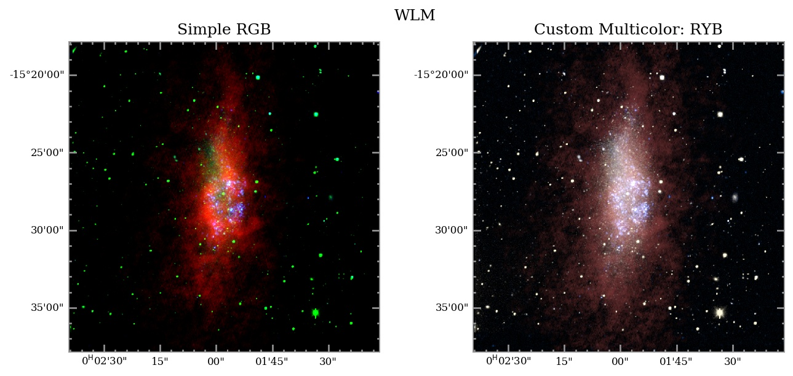

# WLM  


-------  WLM, one of my favorite weird little low-metallicity galaxies  ------- 

 You can download the fits files from [the LITTLE THINGS NRAO data page for WLM](https://science.nrao.edu/science/surveys/littlethings/data/wlm.html)

Here, I use the HI, V-band, and near-UV images.
This script creates a combined image that approximately resembles the nice thumbnail on NRAO data page (which was made in Photoshop, specifically to improve on the slightly 'off' appearance of the simplistic RGB image). 


```python
import numpy as np
import astropy.io.fits as pyfits
import multicolorfits as mcf


### Load the data
wlm_hidat,wlm_hihdr=pyfits.getdata('./WLM_NA_X0_P_R.FITS',header=True)
#wlm_halphadat,wlm_halphahdr=pyfits.getdata('./wlmhmrms.fits',header=True)
wlm_vdat,wlm_vhdr=pyfits.getdata('./wlmv.fits',header=True)
wlm_nuvdat,wlm_nuvhdr=pyfits.getdata('./wlmncut.fit',header=True)

### The original HI Moment-0 map still retains phantom Stokes and velocity axes. Squeeze down to two axes.
wlm_hidat=np.squeeze(wlm_hidat) 
```

- Update the header to 2D as well.  Sometimes downloaded headers have a wealth of information about their reduction process, etc.  But that is usually far more than is required for a simple plotting routine, and sometimes the extra header cards will interfere with the plotting (header says there are 3 axes when plotter expects only 2, etc.).  multicolorfits has a convenience function for forcing a header to 2 dimensions:

```python
wlm_hihdr=mcf.force_hdr_to_2D(wlm_hihdr) 
#This particular header lost its RADESYS card somewhere along the way.  
#  Add it back in manually to enable correct coordinate calculations.
wlm_hihdr['RADESYS']='FK5' #Add the missing RA/DEC system to enable coord conversion
```

- Another option is to simply make a simple 'classic' header from scratch (copying the basic cards needed for WCS).  There is an option to specify the RA/DEC system in case it's needed
```python
wlm_hihdr_simple=mcf.makesimpleheader(wlm_hihdr,radesys='FK5')
```

- Let's select the HI image as the 'master' header, which the other images will be reprojected to, and crop it down slightly to the desired size for the final image.  multicolorfits has convenience functions for this, and they require the reference pixel coordinates (in decimal, though sex2dec can convert from sexagesimal) and the width in arcseconds.
```python
#cropcenter_coords=mcf.sex2dec('0:01:57.796','-15:28:17.127') 
##or, specify directly in decimal:
#cropcenter_coords(0.4908176671,-15.47142427)
## Could also just get the coords from a pixel location -- here let's take the center pixel:
cropcenter_coords=mcf.convpix2sky(wlm_hihdr_simple,512,512) #[0.4908176822975695, -15.464166666280857]
cropwidth_asec=600. #width to extend in either direction from the reference coords (i.e., half-width) 
```

- Now crop the image using the convenience function cropfits2D(), and specify a save path so that we can save a copy to use in the GUI if we want
```python
wlm_hicropdat,wlm_hicrophdr=mcf.cropfits2D_coords(wlm_hidat, wlm_hihdr_simple, 
        cropcenter_coords, cropwidth_asec, savenew='./wlm_hicrop.fits', overwrite=True)
```

- Reproject the other two images to the same (new/cropped) header, and save copies for use in the GUI.
Reprojection can be done using the kapteyn package reproject2D(...,option='kapteyn') or with the reproject package -- 
   - option='interp' for reproject_interp [default]   or 
   - option='spi' for reproject_exact    
   See the kapteyn and reproject package documentation for more info
   
```python
wlm_vcropdat=mcf.reproject2D(wlm_vdat,mcf.makesimpleheader(wlm_vhdr),wlm_hicrophdr);
pyfits.writeto('./wlm_vcrop.fits',wlm_vcropdat,wlm_hicrophdr,overwrite=True)

wlm_nuvcropdat=mcf.reproject2D(wlm_nuvdat,mcf.makesimpleheader(wlm_nuvhdr),wlm_hicrophdr);
pyfits.writeto('./wlm_nuvcrop.fits',wlm_nuvcropdat,wlm_hicrophdr,overwrite=True) 
```


- Now, you could use the GUI to interactively select levels & colors.  Or, can do it in a script...


# Creating the multi-color RGB image

Load in the cropped images here if you don't want to repeat the above process again...
```python
"""
wlm_hicropdat,wlm_hicrophdr=pyfits.getdata('./wlm_hicrop.fits',header=True)
wlm_vcropdat,wlm_vcrophdr=pyfits.getdata('./wlm_vcrop.fits',header=True)
wlm_nuvcropdat,wlm_nuvcrophdr=pyfits.getdata('./wlm_nuvcrop.fits',header=True)
"""
```

- Convert the single images (greyscale) to RGB format (still greyscale, but now with R,G,B channels).  Like in the other example, setting checkscale=True here will bring up a plot window to check your scaling (useful if you're not using the GUI to do this interactively).  Just set to False (default) to skip the popup.
```python
hi_greyRGB=mcf.greyRGBize_image(wlm_hicropdat, rescalefn='asinh', scaletype='perc', 
                                min_max=[1.,99.9], gamma=2.2, checkscale=True) 

v_greyRGB=mcf.greyRGBize_image(wlm_vcropdat, rescalefn='asinh', scaletype='abs', 
                                min_max=[3650.,4800.], gamma=2.2, checkscale=True)

nuv_greyRGB=mcf.greyRGBize_image(wlm_nuvcropdat, rescalefn='asinh', scaletype='perc', 
                                min_max=[20,99.9], gamma=2.2, checkscale=True)
```

- Now colorize the greyscale RGB images using colorize_image(image,color)
The color can be either HTML/HEX, RGB tuples, or HSV tuples (default).  (specify colorintype='hex', 'rgb', 'hsv')
  --> This will take some seconds for very large files.
```python
hi_red=mcf.colorize_image(hi_greyRGB, '#994242', colorintype='hex', gammacorr_color=2.2)
v_yellow=mcf.colorize_image(v_greyRGB, '#FFF9DB', colorintype='hex', gammacorr_color=2.2)
nuv_blue=mcf.colorize_image(nuv_greyRGB, '#1773E9', colorintype='hex', gammacorr_color=2.2)
```

- Combine the separate colored images into one master RGB image
```python
wlm_RYB=mcf.combine_multicolor([hi_red,v_yellow,nuv_blue],gamma=2.2)
```

- Example plot
```python
mcf.plotsinglemulticolorRGB(wlm_RYB, wlm_hicrophdr, 'WLM -- HI (red), V (yellow), NUV (blue)', 
    './WLM_testplot.jpg', tickcolor='0.6', labelcolor='k', facecolor='w', minorticks=True, dpi=150)
```

Here is the result:


- Compare the custom multicolor RGB to the pure (R,G,B) frame image.
```python
# --> Rather than re-scale each original image, just take one of the greyRGB frames from each
wlm_pureRGB=np.dstack([hi_greyRGB[:,:,0],v_greyRGB[:,:,0],nuv_greyRGB[:,:,0]])

mcf.comparemulticolorRGB_pureRGB(wlm_pureRGB, wlm_RYB,wlm_hicrophdr, 
    'Custom Multicolor: RYB',"WLM", './wlm_compare.jpg', tickcolor='0.6', supy=.75)
```



As with the other example, the simple RGB case is good for emphasizing differences in the features.  Of course, this could be achieved in multicolorfits as well with different choices for the image colors.  This is merely intended to be an example of how to produce something that looks nice.  


Save out the RGB fits for later use (can also load in DS9)
```python
mcf.saveRGBfits('./wlm_RYB.fits', wlm_RYB, wlm_hicrophdr)
```


